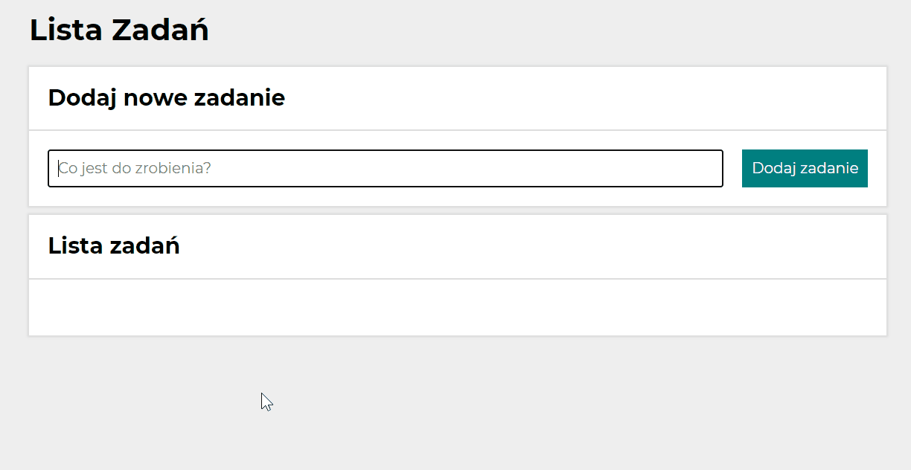
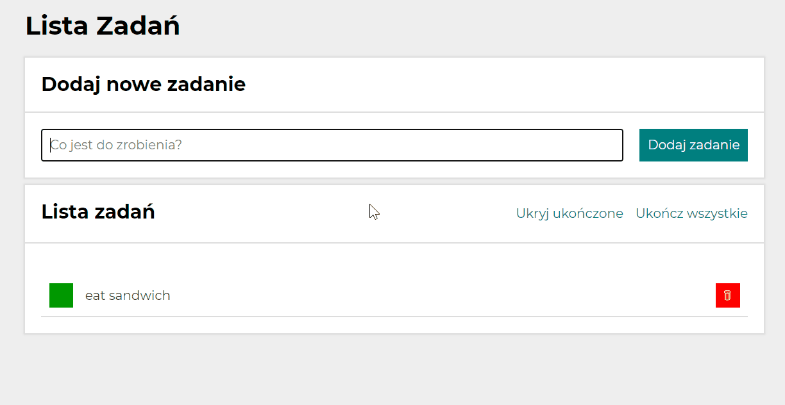
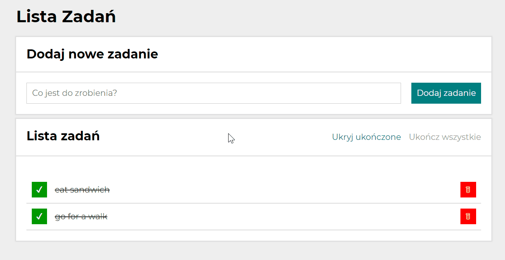

# To-Do List React App

## Demo
https://pawlo1994.github.io/todo-list-react
## Description

Simple to-do list app written in React.js.
This project was bootstrapped with [Create React App](https://github.com/facebook/create-react-app).

## Used Technologies
1. React
2. HTML
3. CSS
4. Flexbox
5. Grid
6. Styled components

## How to use
1. Type your task content in field which is in "Dodaj nowe zadanie" section.

2. Then click on "Dodaj zadanie" button to add your task.

3. If your task is done, you can click on green button which is next to your task text.

4. If you want to delete your task, click on red button with trash.

5. If you want to done all tasks, click on "ukończ wszystkie" button.

6. If you want to hide done tasks, click on "ukryj ukończone". If you want to show them again, click on "pokaż ukończone".

Now your to-do list saves automaticaly after every update.

## Available Scripts

In the project directory, you can run:

### `npm start`

Runs the app in the development mode.\
Open [http://localhost:3000](http://localhost:3000) to view it in the browser.

The page will reload if you make edits.\
You will also see any lint errors in the console.
### `npm run build`

Builds the app for production to the `build` folder.\
It correctly bundles React in production mode and optimizes the build for the best performance.

The build is minified and the filenames include the hashes.\
Your app is ready to be deployed!

See the section about [deployment](https://facebook.github.io/create-react-app/docs/deployment) for more information.

### `npm run eject`

**Note: this is a one-way operation. Once you `eject`, you can’t go back!**

If you aren’t satisfied with the build tool and configuration choices, you can `eject` at any time. This command will remove the single build dependency from your project.

Instead, it will copy all the configuration files and the transitive dependencies (webpack, Babel, ESLint, etc) right into your project so you have full control over them. All of the commands except `eject` will still work, but they will point to the copied scripts so you can tweak them. At this point you’re on your own.

You don’t have to ever use `eject`. The curated feature set is suitable for small and middle deployments, and you shouldn’t feel obligated to use this feature. However we understand that this tool wouldn’t be useful if you couldn’t customize it when you are ready for it.